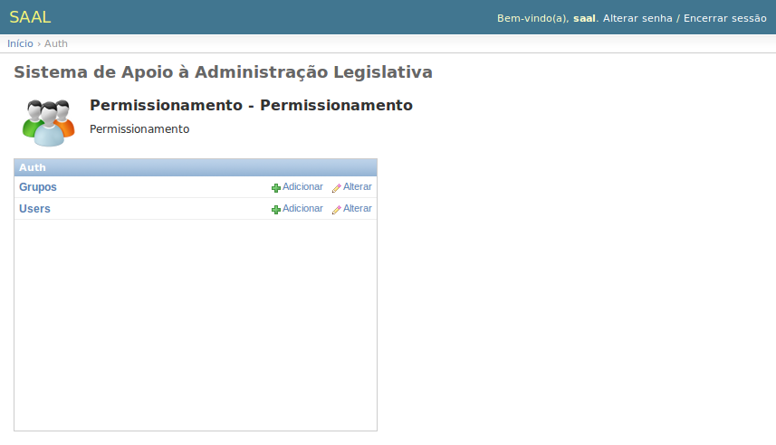
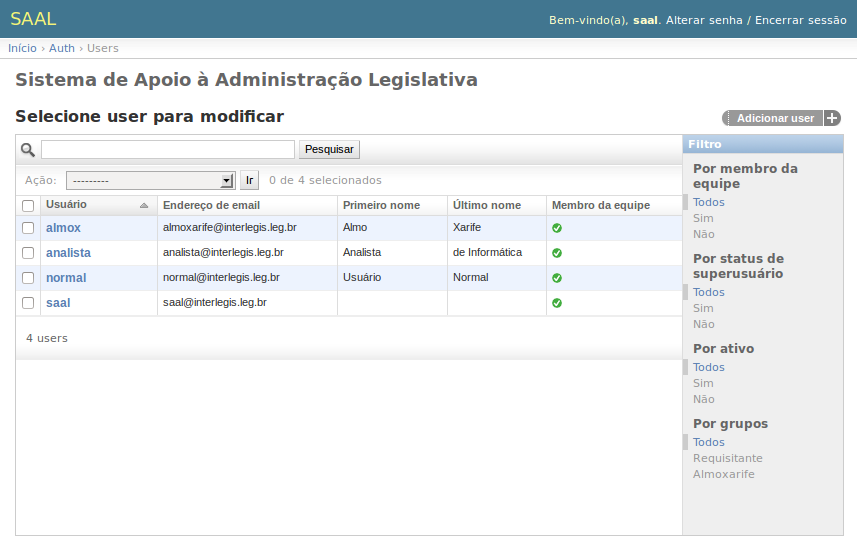
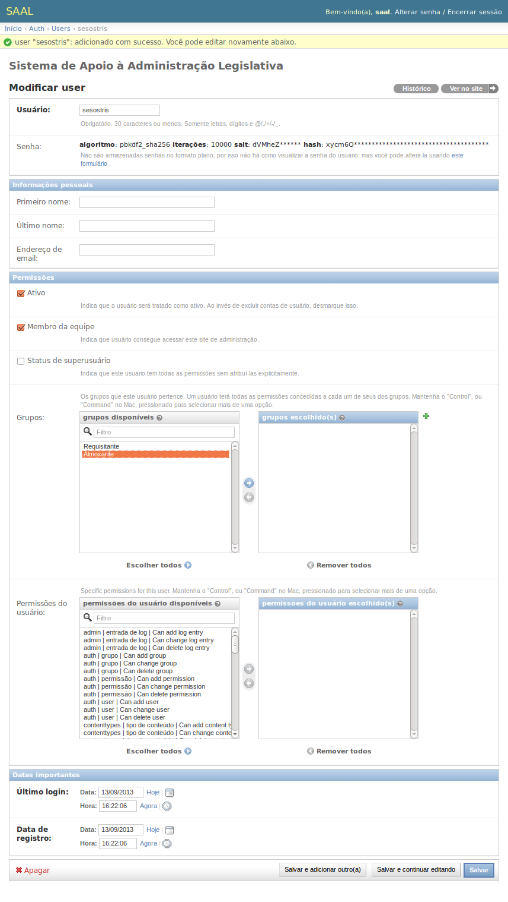
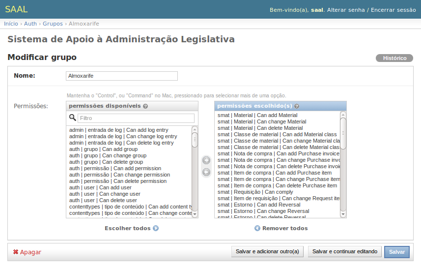

Permissionamento
================

O aplicativo de permissionamento, acessível para o
:ref:`usuário administrador <intro_admin_user>`, permite gerenciar os usuários
que terão acesso ao sistema, bem como as permissões que cada um possuirá.

O Django possui um sistema de autenticação do usuário (veja informações
técnicas sobre o sistema de autenticação do Django em 
https://docs.djangoproject.com/en/1.5/topics/auth/) que gerencia contas de
usuários, grupos, permissões e sessão de uso.

O sistema de autenticação gerencia tanto autenticação quanto autorização.
Resumidamente, autenticação verifica se um usuário é mesmo quem diz ser, e
autorização determina o que um usuário autenticado pode fazer. Usaremos o termo
autenticação para os dois casos.

O sistema de autenticação consiste de:

* Usuários;
* Permissões: Indicações do tipo sim/não designando se um usuário pode realizar
  uma determinada tarefa;
* Grupos: Uma forma genérica de rotular e dar permissões a vários usuários.

Usuários
--------

Usuários são o núcleo do sistema de autenticação. Tipicamente representam as
pessoas que interagem com o sistema e são usados para decidir coisas como
restrição de acesso, associação de conteúdos com seus criadores, etc.

No link **Users** na :ref:`intro_app_index` do sistema de permissionamento
você gerencia os usuários.

Ao adicionar um usuário, você deve informar inicialmente o **Usuário**, que será
o nome que deverá ser usado no momento do :term:`login` e que identificará
a pessoa, a **Senha** e a **Confirmação de senha**. Só será possível salvar os
dados e prosseguir com o cadastro de usuário se os campos **Senha** e
**Confirmação de senha** forem exatamente iguais, garantindo que não houve
erro de digitação. 

Ao salvar, um novo formulário é apresentado para que se possa complementar os
dados do usuário. Devem-se preencher os campos **Primeiro nome**,
**Último nome**, **Endereço de email**. Se o campo **Ativo** for desmarcado
o usuário não conseguirá fazer :term:`login` no sistema. É preciso também marcar
a caixa **Membro da equipe** para que o usuário possa acessar a interface do
SAAL.

O campo **Status de superusuário** dá ao usuário plenos poderes no sistema,
inclusive criar novos usuários e realizar tarefas administrativas. O ideal é
que apenas o :ref:`usuário administrador <intro_admin_user>` tenha essa
permissão ativada.

O campo **Grupos** mostra todos os grupos disponíveis no sistema e os grupos aos
quais o usuário pertence. Um usuário terá todas as permissões concedidas a
cada um de seus dos grupos. Mantenha o "Control", ou "Command" no Mac,
pressionado para selecionar mais de uma opção. Use os botões de setas da tela
para incluir ou excluir grupos da caixa de **Grupos escolhidos**.

.. rubric:: Alterando senhas 

Cada usuário pode alterar sua própria senha usando o link *Alterar senha* que
se encontra junto à saudação do sistema, no cabeçalho das páginas.   

As senhas dos usuários não são exibidas no sistema nem salvas no banco de dados,
porém, detalhes do armazenamento da senha são mostrados no 
:ref:`intro_changeform` de usuários. Junto dessas informações há um link para
um formulário de alteração de senha onde o administrador poderá alterar as
senhas dos usuários. Essa alternativa é útil quando o usuário perde ou esquece
sua senha.

Grupos
------

Grupos são uma forma genérica de categorizar usuários aos quais se pode aplicar
permissões de forma coletiva. Entenda os grupos como perfis de usuário ou os
papéis que os atores assumem. Um usuário pode pertencer a mais de um grupo.

Um usuário em um grupo automaticamente tem todas as permissões dadas ao grupo.
por exemplo, se o grupo Almoxarife tem a permissão *Can add Material*, qualquer
usuário neste grupo terá também essa permissão.

O SAAL já traz diversos grupos pré-cadastrados com as permissões em conformidade
com as especificações dos atores definidas na documentação técnica do sistema.
Estes grupos podem ser modificados e outros podem ser criados de acordo com as
necessidades e características de cada Casa Legislativa.

