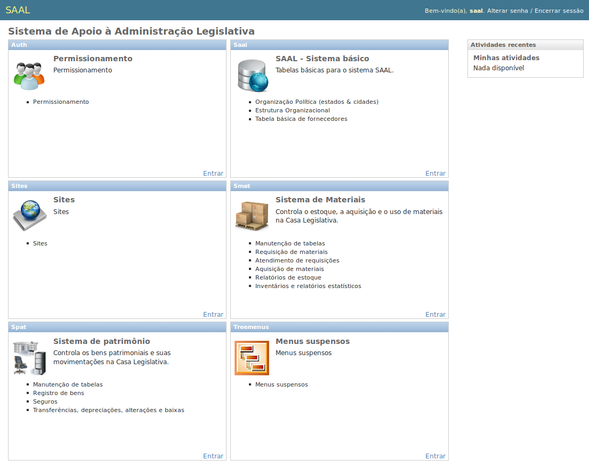
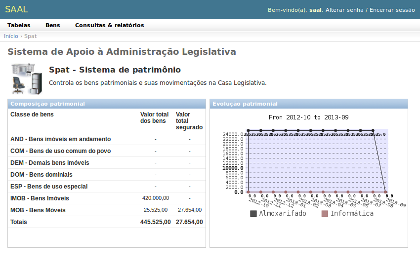
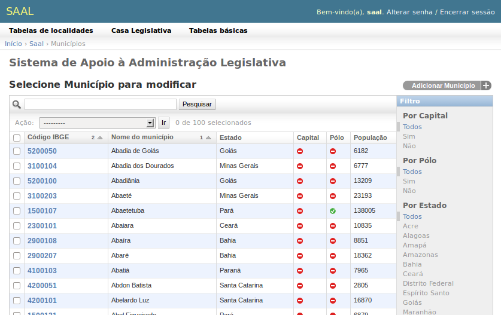
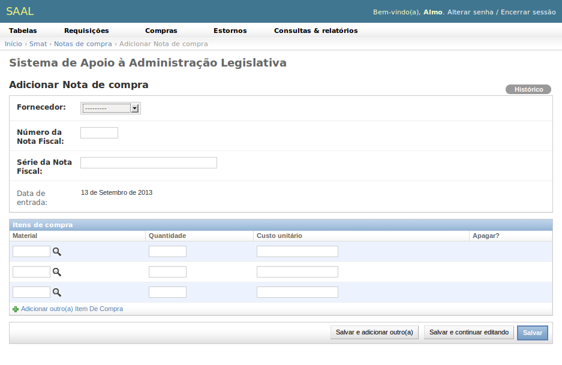

Introdução
==========

O SAAL foi desenvolvido com o `Framework Django <https://www.djangoproject.com/>`_,
versão 1.5, utilizando recursos da Interface Administrativa, que acelera o
processo de desenvolvimento e fornece uma interface homogênea,  intuitiva e
fácil de usar.

.. _intro_admin_user:

Ao instalar o SAAL, foi oferecida a opção de se criar um usuário administrador.
Este usuário deve ser utilizado para acessar o sistema sempre que for 
necessário realizar tarefas administrativas, como cadastramento de novos
usuários, alteração de permissões de acesso, exclusão de usuários, modificações
em tabelas administrativas, dentre outros.

O SAAL possui algumas telas genéricas que facilitam o uso do sistema. São elas:

.. _intro_index:

Página do sistema
-----------------

É a página principal do SAAL, apresentada assim que o usuário efetua 
:term:`login`.

Esta página possui um cabeçalho, com as boas-vindas ao usuário, e apresenta
todos os módulos que ele tem acesso. Cada aplicação é apresentada em uma caixa
distinta, contendo a sigla, o ícone, o nome, uma breve descrição e
uma lista das principais funcionalidades da aplicação.

Para acessar uma aplicação, pode-se clicar na barra de título da caixa, no ícone
da aplicação, em seu título ou no link *Entrar* na extremidade inferior direita
da caixa.

A página principal do SAAL apresenta ainda uma caixa que relaciona as atividades
recentes realizadas pelos usuários no sistema. Permite que se acesse e
verifique os objetos alterados mais recentemente.

.. _intro_app_index:

Página de aplicação
-------------------

Ao acessar uma aplicação, é apresentada sua página inicial.

A página inicial das aplicações possui, logo abaixo da barra de boas-vindas,
uma barra de :term:`menu suspenso`, que permite acessar as suas funcionalidades
de forma rápida e intuitiva.

Logo abaixo da barra de menus, encontra-se a barra de :term:`breadcrumbs`, que
permite visualizar e retornar às partes do sistema já percorridas. Para retornar
à :ref:`intro_index`, clique no link *Início* na barra de bradcrumbs.

Em seguida vêm o título da aplicação e seu :term:`dashboard`, que dá uma
visão instantânea do desempenho do sistema.

.. intro_changelist:

Lista de objetos
----------------

Ao acessar uma funcionalidade, é apresentada a lista de objetos relativos àquela
funcionalidade. A lista de objetos permite visualizar os objetos do sistema,
aplicar filtros, realizar pesquisas, e classificar os dados.

A lista de objetos possui uma barra de ferramentas de objetos, com botões
que permitem acrescentar novos objetos (Adicionar) e também fornece outras
utilidades, como gerar um relatório impresso em PDF dos dados selecionados.

Possui também a caixa de filtros, que traz os filtros que podem ser aplicados
aos objetos. Os filtros podem ser combinados, isso é, podem-se filtrar todos
os municípios que sejam Pólo regional E que sejam do Estado de Minas Gerais.

A barra de pesquisa possui um campo onde pode ser digitada qualquer expressão
a ser buscada na lista de objetos. A pesquisa não faz distinção entre letras
maiúsculas e minúsculas, mas, dependendo do banco de dados utilizado e de sua
configuração, pode fazer distinção entre letras acentuadas e sem acentuação ou
maiúsculas e minúsculas acentuadas.

Abaixo da barra de pesquisa tem a barra de ações. Como as ações do campo
**Ação** afetam muitos objetos, são aplicadas somente sobre os aqueles objetos
que forem explicitamente selecionados pela caixa de seleção de cada objeto na
lista de objetos.

A lista de objetos propriamente apresenta, em forma de tabela, informações
acerca dos objetos, como seu código, descrição ou outras informações que ajudam
a identificá-lo ou que sejam interessantes. O cabeçalho da lista de objetos,
além de rotular a informação, permite que se defina a ordenação dos dados em
**Ascendente** (um clique) ou **Descendente** (dois cliques). Indicadores
visuais no próprio cabeçalho, como setas ou números, informam quais colunas
estão ordenadas, sua precedência e sentido.

Cada linha na lista de objetos possui um campo clicável que dá acesso ao objeto
representado por aquela linha. Ao se clicar, por exemplo, no código IBGE do
de Abadia dos Dourados tem-se acesso ao formulário de edição deste município,
onde seus dados poderão ser alterados e salvos.

.. _intro_changeform:

Formulário de edição
--------------------

Permite alterar ou adicionar objetos no sistema. Possui uma barra de ferramentas
que dá acesso a algumas ações específicas do próprio objeto (ex: visualizar
seu histórico de modificações).

O formulário pode ser dividido em sessões que agrupam informações de um mesmo
tipo, dando maior clareza à interface. Os campos obrigatórios têm seus rótulos
destacados em negrito e devem ser obrigatoriamente preenchidos.

As informações múltiplas, como os itens de uma nota de compra, são coletadas
em caixas especiais, que permitem a digitação de vários registros do mesmo tipo.
Essas caixas vêm com uma quantidade mínima de linhas em branco para serem
preenchidas. Se esse número for insuficiente, pode-se clicar em
**Adicionar outro** para criar novas linhas em branco. Linhas deixadas em branco
não serão processadas.

Ao final do formulário há a barra de submissão, que permite salvar o registro
ou excluí-lo do banco de dados. Toda alteração deve ser salva por meio dessa
barra.

