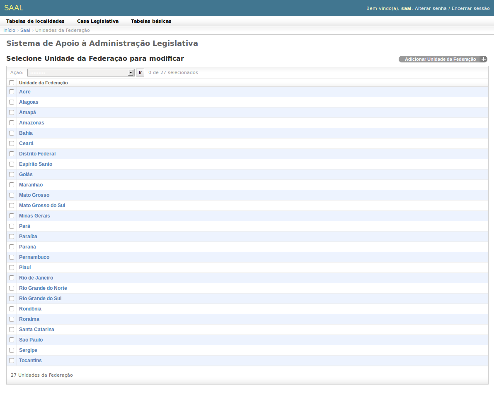
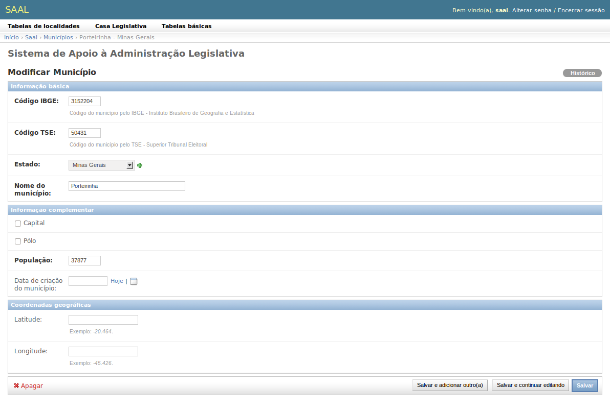
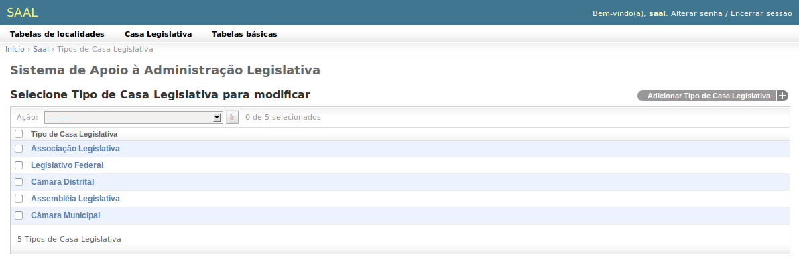
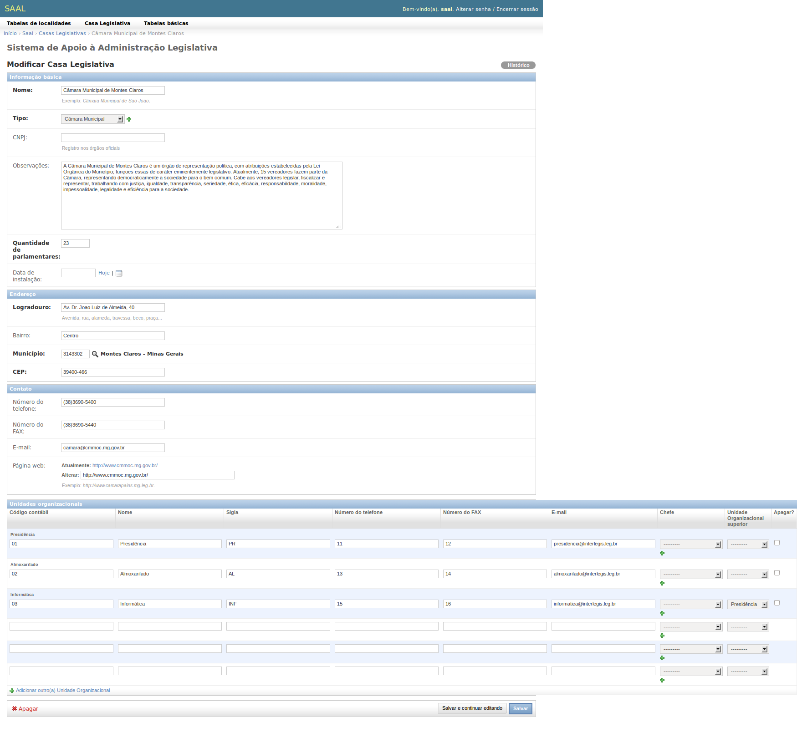
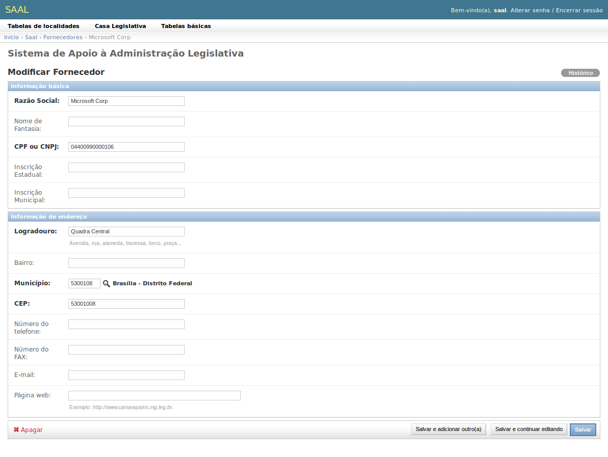
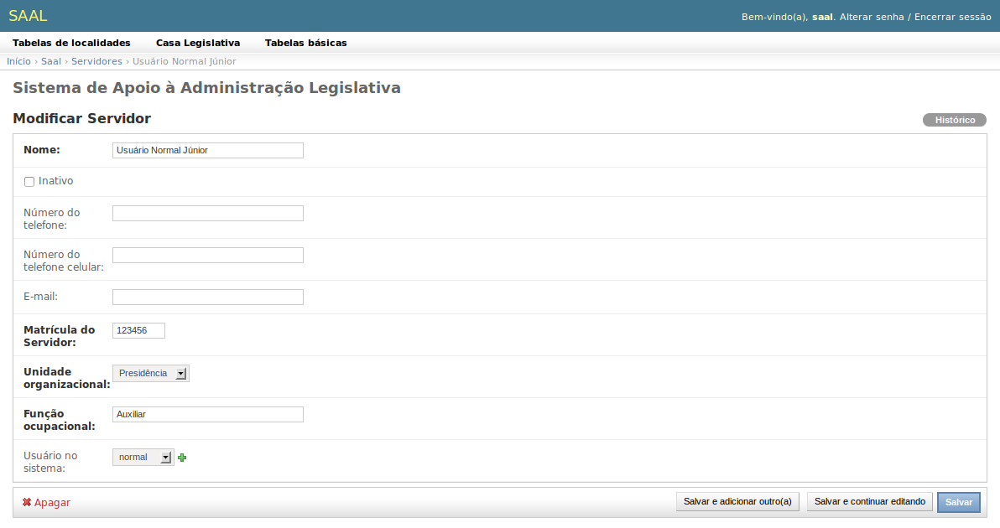

SAAL - Sistema básico
=====================

O sistema básico do SAAL gerencia as tabelas e funcionalidades básicas que 
envolvem mais de uma aplicação. Desta forma, garante-se a alta coesão dos
aplicativos e o baixo acoplamento entre eles.

Tabelas de localidades
----------------------

As tabelas de localidades trazem as informações das **Unidades da Federação** e
dos **Municípios** brasileiros. Estas tabelas são carregadas com os dados dos
Estados e Municípios brasileiros obtidos no :term:`IBGE` e só precisam ser
alteradas caso haja alterações na organização política do Brasil, como fusão ou
desmembramento de Estados ou emancipação de municípios.

.. _saal_federativeunit:

Unidades da federação
"""""""""""""""""""""

Relaciona os Estados (Unidades da federação) do Brasil. As informações 
registradas são o Código IBGE, o nome do Estado, a sigla e a população.

.. _saal_city:

Municípios
""""""""""
Possui o cadastro dos Municípios brasileiros, de acordo com o :term:`IBGE`.
Registra os códigos IBGE e :term:`TSE` do município, o Estado onde se localiza
e o nome do município, como informações básicas. Além disso, registra
informações complementares, como os indicadores de Capital e Pólo (regional),
população e data de criação do município, e as coordenadas geográficas
Latitude e Longitude.  

Casa Legislativa
----------------

Registra a Casa Legislativa que está utilizando o sistema. Possui duas tabelas:

.. _saal_legislativehousetype:

Tipo de Casa Legislativa
""""""""""""""""""""""""

Relaciona os tipos de instituições vinculadas ao Poder Legislativo e que podem
ter interesse no sistema.

.. _saal_legislativehouse:

Casa Legislativa
""""""""""""""""

Esta é a tabela mais atípica do sistema. Ela permite que seja cadastrada apenas
uma Casa Legislativa. Depois que a Casa foi cadastrada, o botão **Adicionar**
da :ref:`intro_changelist` não é mais apresentado, permitindo apenas que o
usuário faça alterações no cadastro da sua Casa. Este comportamento se deve ao
fato de o sistema ser mono-empresa, ou seja, só possa ser usado por uma única
Casa Legislativa por instalação.

Além das informações cadastrais (informações básicas, de endereço e contatos),
deve-se informar as :term:`Unidades Organizacionais` que existem na Casa. Para
cada unidade, deve-se cadastrar seu código contábil, nome, sigla, telefone, fax,
e-mail, chefe (que é um :ref:`servidor <saal_employeebase>` e precisa estar
previamente cadastrado), a Unidade Organizacional superior, ou seja, a Unidade
Organizacional à qual está hierarquicamente subordinada. Esta Unidade
Organizacional Superior precisa estar previamente cadastrada para aparecer na
lista, portanto, a melhor forma de cadastrar é:

* Cadastrar as Unidades Organizacionais de nível hierárquico mais alto, que não
  estão subordinadas a nenhuma outra;
* Salvar e continuar editando a Casa, dessa forma, as Unidades cadastradas no
  passo anterior já serão salvas e aparecerão na lista de Unidade Organizacional
  Superior;
* Cadastrar as Unidades de segundo nível, que sejam subordinadas àquelas já
  cadastradas. Repetir o 2º e 3º passos para os demais níveis, até concluir o
  cadastro de todas as Unidades.
  
Como o chefe da Unidade deve ser um :ref:`servidor <saal_employeebase>`, que
precisa estar previamente cadastrado para aparecer na lista, é melhor deixar
este campo em branco em todas as unidades e, depois de cadastrados os
:ref:`servidores <saal_employeebase>`, voltar e preencher o campo Chefe.

Tabelas Básicas
---------------

As tabelas básicas são:

.. _saal_supplierbase:

Fornecedores
""""""""""""

Permite cadastrar os fornecedores que comercializam seus produtos e serviços com
a Casa Legislativa, tanto pessoas físicas quanto jurídicas.

 
São coletadas as informações básicas, como Razão Social, Nome de Fantasia,
CPF, se pessoa física, ou CNPJ se jurídica, inscrição estadual e inscrição
municipal. As informações de endereço são: :term:`logradouro`, bairro,
:ref:`município <saal_city>`, :term:`CEP`, número de telefone, fax, e-mail
e página web.

.. _saal_employeebase:

Servidores
""""""""""

Mantém o registro dos servidores da Casa Legislativa. Registra informações
básicas de identificação e contato (nome, telefone, celular, e-mail), e lotação
(matrícula, unidade organizacional onde está lotado e função ocupacional).

Se o servidor vai utilizar o sistema, deve-se vinculá-lo a um Usuário através do
campo **Usuário do sistema**. Diversas rotinas utilizam esse vínculo para
verificar as permissões do usuário e para vinculação com a pessoa e/ou Unidade
Organizacional.

Nem todo servidor cadastrado precisa estar vinculado a um Usuário, mas o ideal
é que todo usuário esteja vinculado a um servidor, exceto o
:ref:`usuário administrador <intro_admin_user>`.

