Smat - Sistema de Materiais
===========================

O Sistema de Materiais controla o estoque, a aquisição e o uso de materiais 
de consumo na Casa Legislativa. Provê funcionalidades para requisição de
materiais, atendimento de requisições, aquisição de materiais, relatórios de
estoque, inventários e relatórios estatísticos.

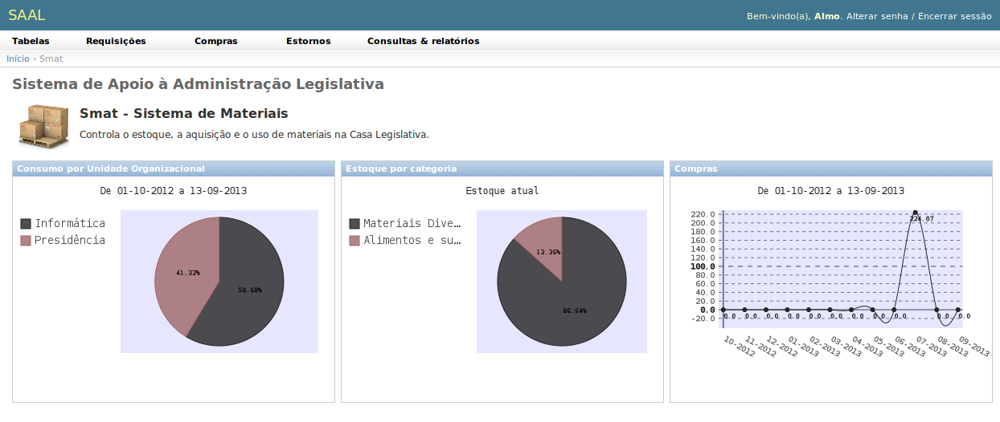

Seu :term:`dashboard` apresenta três gráficos:

* Consumo por Unidade Organizacional, que mostra o percentual de
  consumo, nos últimos 12 meses, de cada Unidade Organizacional;
* Estoque por categoria: Mostra a participação, nos custos do estoque atual,
  de cada categoria de materiais;
* Compras: Mostra a curva de compras dos últimos 12 meses, apresentando a
  sazonalidade das compras da Casa Legislativa.

Seu :term:`menu suspenso` apresenta as seguintes funcionalidades:

Tabelas
-------

Permite gerenciar as tabelas do sistema de materiais, que são:

.. _smat_materialclass:

Classes de material
"""""""""""""""""""

Permite classificar os materiais de consumo em classes, facilitando a
organização do almoxarifado, a pesquisa de materiais, e a contabilização de
gastos. Cada Classe de Material possui uma sigla e uma descrição.

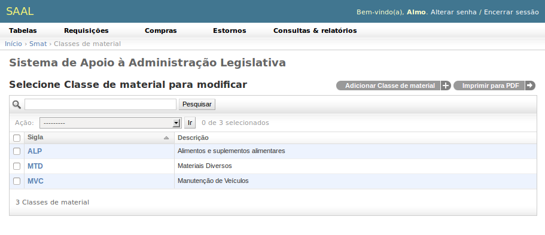

.. _smat_material:
 
Materiais
"""""""""
 
É a tabela de materiais de consumo do sistema. A :ref:`intro_changelist`
apresenta os materiais ordenados por seu código contábil (código do item). 
Mostra ainda a quantidade em estoque, os estoques mínimos e máximos e os pontos
de suprimento dos materiais.

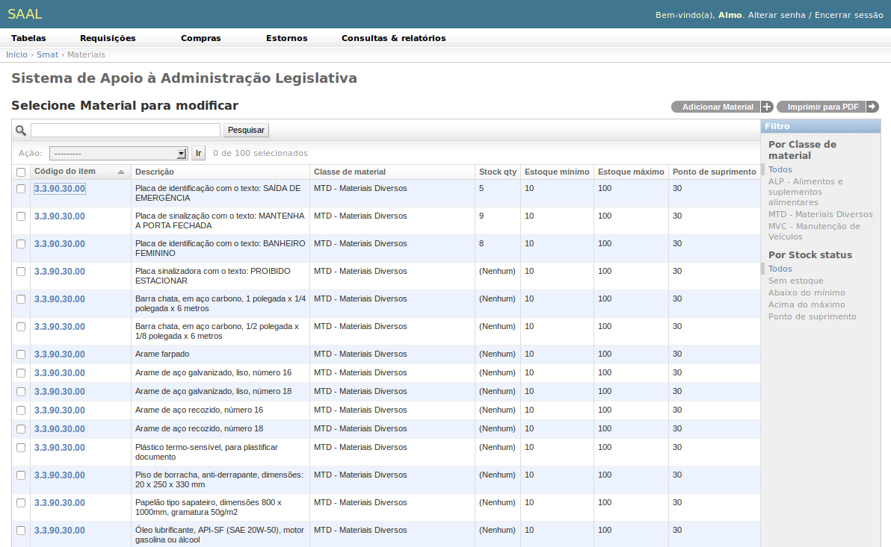
 
Permite filtrar os materiais por :ref:`smat_materialclass` ou pelo
**estado do estoque**, que pode ser:
 
* Sem estoque: os materiais que não têm saldo em estoque (saldo igual a zero);
* Abaixo do mínimo: os que estão com estoque abaixo do ponto mínimo aceitável,
  indicando risco de falta de suprimento;
* Acima do máximo: com saldo acima do máximo admissível, indicando sobrecompra
  e risco de perdas;
* Ponto de suprimento: Os materiais que devem ter processos de compra
  iniciados imediatamente para que não haja falta de suprimento.
 
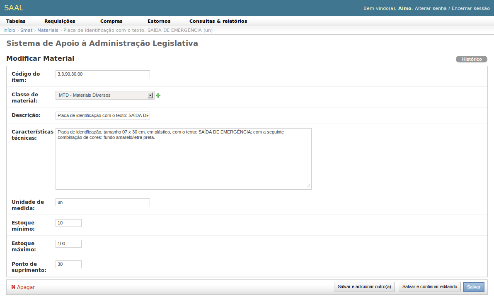

O campo **Código de item** deve conter o código com o qual o item de material de
consumo deve figurar contabilmente. A **Unidade de medida** deve ser fixada na
menor unidade de compra ou de consumo. O sistema não permite unidades diferentes
para compra e consumo, não faz agregações ou desmembramentos.

Os campos **Estoque mínimo**, **Estoque máximo** e **Ponto de suprimento** 
devem ser calculados com base em prazo de validade, volume médio de consumo,
condições e capacidade de estocagem, tempo de reposição (tempo transcorrido
desde o início do processo de compra até a efetiva disponibilização do material 
em estoque). Esses números, quando bem afinados, ajudam a evitar desperdícios
e indisponibilidade de estoque (economicidade e eficiência).

.. note:
   Não há campo próprio para se informar o estoque atual do material nem seu
   custo unitário, pois estas informações serão manipuladas pelas
   funcionalidades do sistema, como requisições, compras e estornos. 
   
.. _smat_request:
 
Requisições
-----------

A funcionalidade de requisições tem comportamentos diferentes dependendo do
grupo ao qual o usuário pertence. Se seu grupo for **Requisitante**, então o
usuário poderá adicionar requisições e poderá ver as requisições que criou e que
ainda não foram atendidas.

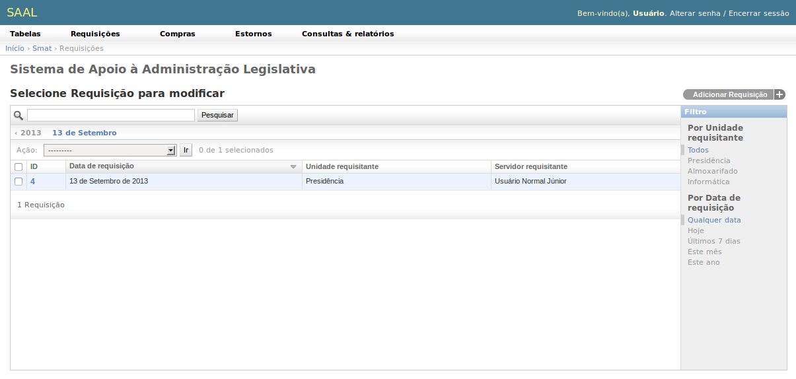

Ao adicionar ou alterar uma requisição, o requisitante informa apenas os 
**Itens de requisição**, que é a relação de materiais e as quantidades 
desejadas. Além dessas informações, o sistema coleta automaticamente a Unidade
Organizacional do servidor requisitante, a identidade desse servidor e a data
de requisição. 

Para os usuários do grupo **Almoxarife** são listadas todas as requisições não
atendidas de todas as Unidades Organizacionais. Apenas usuários do grupo
almoxarife podem realizar o atendimento das requisições.

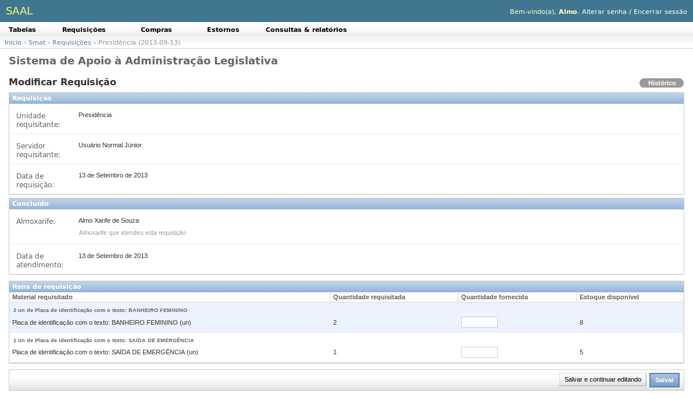

Os **Itens de requisição** aparecem, para o almoxarife, com dois campos extras:

* Quantidade fornecida: permite informar qual a quantidade do material 
  que o almoxarife entregará ao requisitante;
* Estoque disponível: Informa ao almoxarife qual a disponibilidade em estoque
  do material requisitado.
  
A **Quantidade fornecida** não pode ser superior ao estoque disponível nem à
quantidade requisitada. Se o almoxarife fornececer zero unidades ou deixar o
campo em branco, o sistema considerará que o pedido do material foi indeferido.

Quando o almoxarife salva a requisição, o atendimento é realizado, os saldos
físicos e financeiros são computados e esta requisição não poderá mais ser
visitada nem pelo almoxarife nem pelo requisitante.

.. _smat_purchase:

Compras
-------

As Notas de Compra permitem registrar no sistema as entradas Material de 
Consumo referenctes às aquisições da Casa Legislativa.

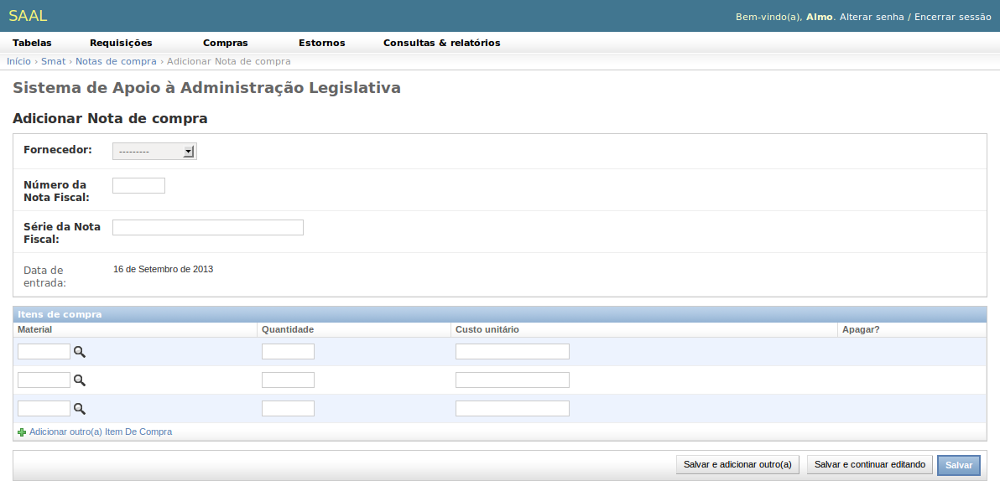

Deve ser informado o :ref:`fornecedor <saal_supplierbase>` que forneceu os
materiais, o número e a série da Nota Fiscal. A data de entrada é a data
corrente.

Na caixa Itens de Compra devem ser informados os materiais adquiridos, seu
custo unitário e a quantidade. Note que a quantidade deve ser relativa à unidade
de medida do :ref:`material <smat_material>` adquirido.

Uma vez salva a Nota de Compra, os saldos disponíveis são recalculados e um novo
lote de materiais é criado no estoque. As notas já salvas podem ser visualizadas
pelo almoxarife, mas não podem ser excluídas nem modificadas.

Estornos
--------

As notas de estorno permitem fazer ajustes de estoque. Podem ser estornos de
Entrada ou Saída.

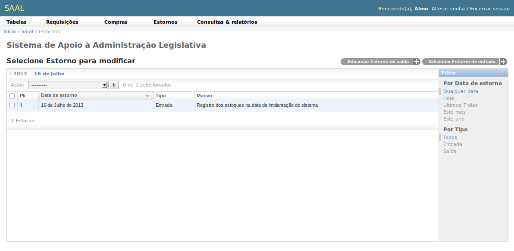

A data do estorno é a data atual e o tipo é selecionado a partir dos botões
**Adicionar Estorno de Entada** ou **Adicionar Estorno de Saída**. O campo
Motivo serve de histórico de registro do estorno.

Para cada item estornado, informe o material e a quantidade estornada. Se for
um estorno de entrada, informe o custo unitário do material que entra. Para os
estornos de saída o sistema calcula automaticamente o custo pelo algoritmo
:term:`PEPS`.

Consultas e Relatórios
----------------------

Dá acesso a quatro relatórios do sistema de materiais:

.. _smat_inventoryreport:

Relatório de inventário
"""""""""""""""""""""""

Calcula o inventário físico e financeiro do estoque para um dado um período
e uma classe de material, ou todas as classes simultaneamente.

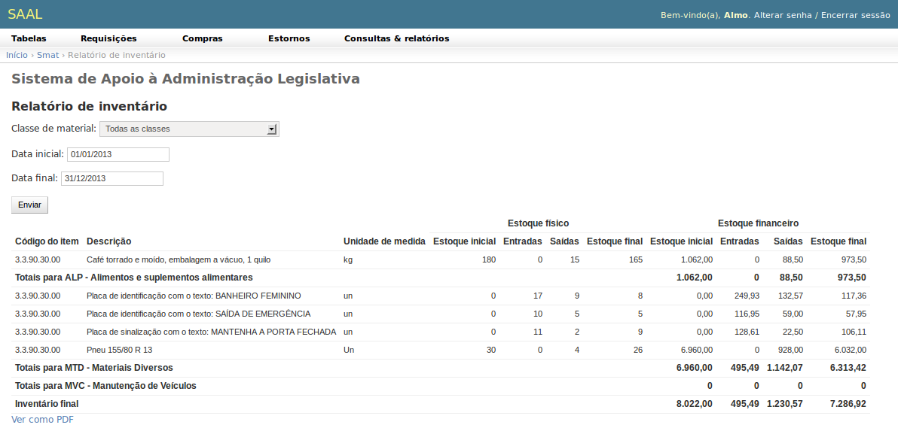

O relatório apresenta as seguintes colunas:

* Código do item: Código contábil do material inventariado;
* Descrição: Descrição do material inventariado;
* Unidade de medida;
* Estoque físico (quantitativos), e
* Estoque financeiro.

Tanto o estoque físico quanto o financeiro são detalhados em três outros campos:

* Estoque inicial: saldo que tinha o material antes do inventário;
* Entradas: Total de entradas que ocorreram no período inventariado;
* Saídas: Total de saídas que ocorreram no período do inventário;
* Estoque final: Saldo que o material ficou ao final do período inventariado.

O **Estoque Final** será sempre igual ao **Estoque inicial** mais as
**Entradas** menos as **saídas**.

O relatório apresenta quebras totalizadas por classe de material e apresenta
o total geral ao final do relatório.

.. _smat_requestreport:

Requisições por unidade
"""""""""""""""""""""""

Lista todos os materiais requisitados e atendidos por unidade em um período de
tempo. Apresenta a data de atendimento; a unidade requisitante; o código, a
descrição e a unidade do material requisitado; e o custo do atendimento.

O relatório agrupa os dados por unidade requisitante com uma quebra totalizada,
além da soma do custo total ao final.

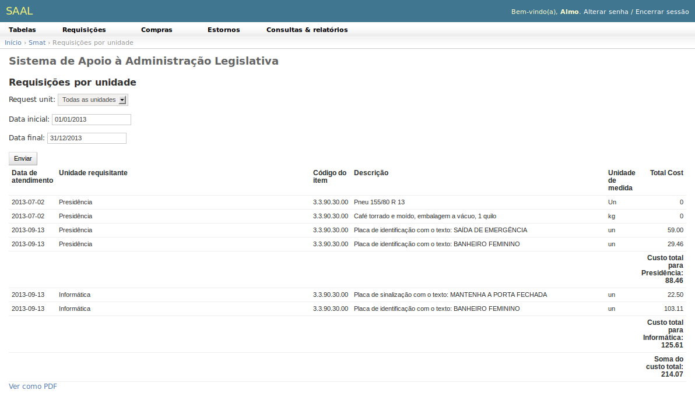

.. _smat_totalcostreport:

Custo total por unidade
"""""""""""""""""""""""

Lista o código contábil e o nome do setor, e seu custo total em consumo de
materiais em um período.

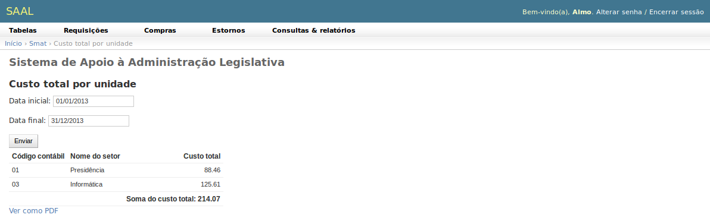

.. _smat_purchasereport:

Compras por período
"""""""""""""""""""

Relaciona os materiais adquiridos no período, mostrando a data da compra, a
classe do material, o código contábil, descrição e unidade do material, a
quantidade adquirida, o custo unitário e total da aquisição. Possui quebra
totalizada por classe de materiais e apresenta a soma do custo total ao final.

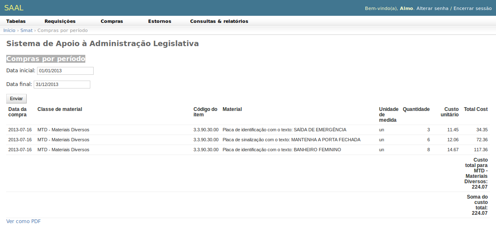