Spat - Sistema de patrimônio
============================

O sistema de patrimônio controla os bens patrimoniais e suas movimentações na
Casa Legislativa. Prevê o registro de bens, seguros, transferências,
depreciações, alterações e baixas.

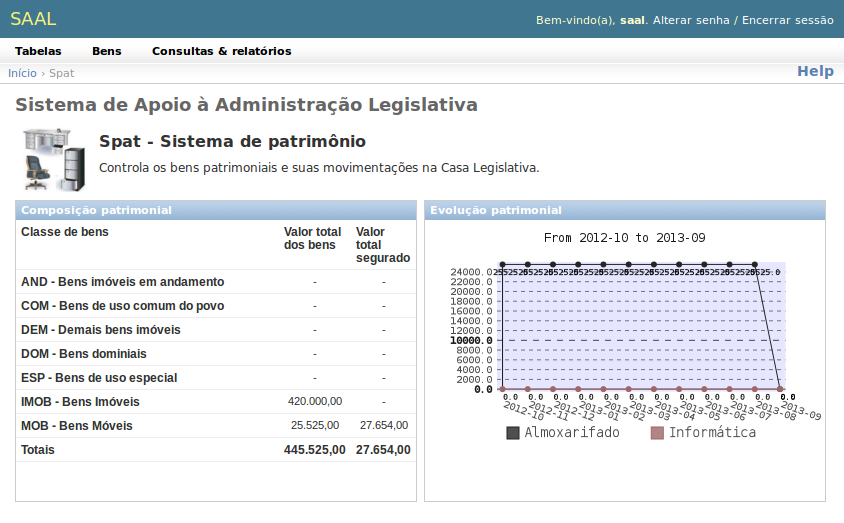

Seu :term:`dashboard` possui uma tabela com a composição patrimonial da
Casa Legislativa, onde se apresentam o valor total dos bens patrimoniados e
o total segurado para cada classe de bens e um gráfico da evolução patrimonial,
que mostra a variação patrimonial de cada :term:`Unidade Organizacional` ao 
longo dos últimos doze meses.

Tabelas
-------

O SPAT possui três tabelas:

.. _spat_assetclass:

Classe de bens
""""""""""""""

Permite classificar os bens, no intuito de organizar os dados, simplificar
buscas e contabilizar os ativos patrimoniais. Possui Sigla e descrição.  

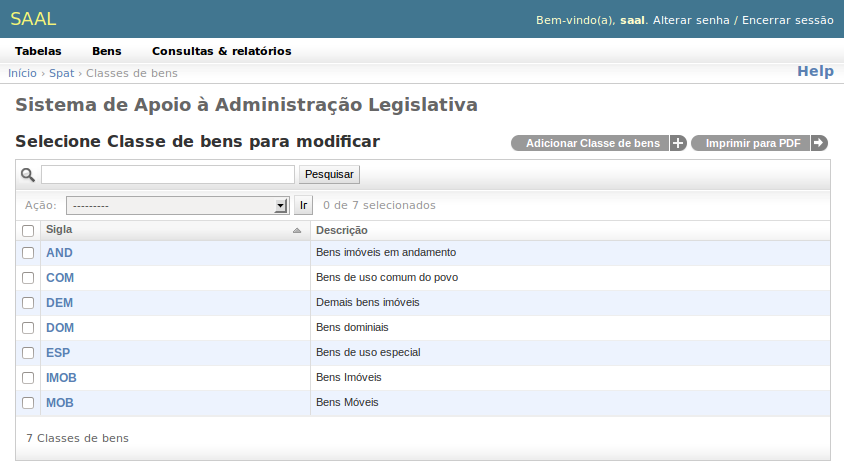

.. _spat_assetcatalog:

Catálogo de bens
""""""""""""""""

Cataloga os bens descrevendo-os sem, no entanto, individualizá-los, com o
intuito de granularizar melhor a organização e classificação dos bens. Registra
o código do item, a classe de bens, a descrição e as características técnicas.  

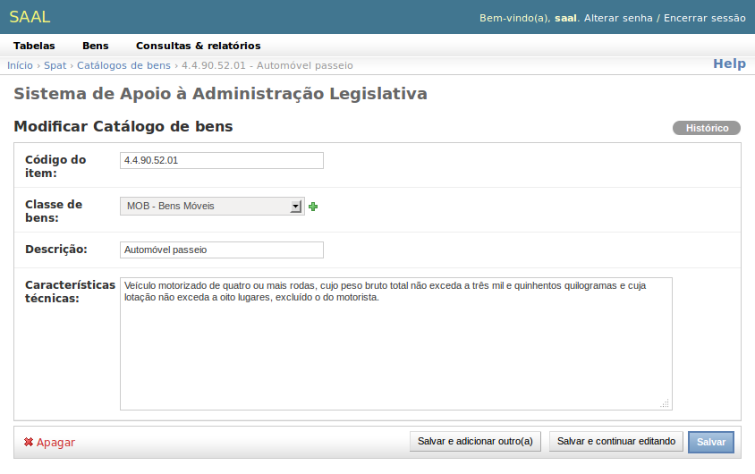

.. _spat_termmodel:

Modelos de termos
"""""""""""""""""

Permite definir modelos personalizados de documentos que o sistema usará para
emitir os termos de transferência, baixa, alteração e depreciação.

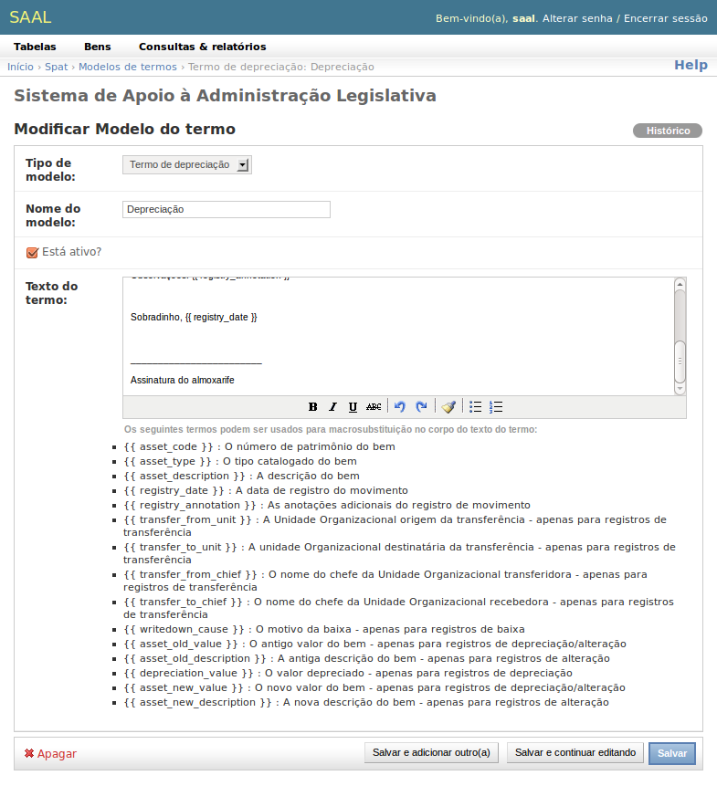

Podem existir quantos modelos se desejar para cada tipo de termo. O campo
**Está ativo?** indica se o termo pode ser usado para registrar movimentos.

O campo **Texto do termo** permite a edição do texto base do termo. É um editor
de textos simples com alguns recursos de formatação. Podem ser inseridos no
texto alguns campos de :term:`macrosubstituição`.Essas marcações serão 
substituídas pelos equivalentes valores no momento da impressão do termo.
Alguns campos de macro são genéricos para qualquer tipo de termo, outros são
específicos por tipo. Os campos são os seguintes:

* **{{ asset_code }}**: O número de patrimônio do bem
* **{{ asset_type }}**: O tipo catalogado do bem
* **{{ asset_description }}**: A descrição do bem
* **{{ registry_date }}**: A data de registro do movimento
* **{{ registry_annotation }}**: As anotações adicionais do registro de
  movimento
* **{{ transfer_from_unit }}**: A Unidade Organizacional origem da
  transferência - apenas para registros de transferência
* **{{ transfer_to_unit }}**: A unidade Organizacional destinatária da
  transferência - apenas para registros de transferência
* **{{ transfer_from_chief }}**: O nome do chefe da Unidade Organizacional
  transferidora - apenas para registros de transferência
* **{{ transfer_to_chief }}**: O nome do chefe da Unidade Organizacional
  recebedora - apenas para registros de transferência
* **{{ writedown_cause }}**: O motivo da baixa - apenas para registros de baixa
* **{{ asset_old_value }}**: O antigo valor do bem - apenas para registros de
  depreciação/alteração
* **{{ asset_old_description }}**: A antiga descrição do bem - apenas para
  registros de alteração
* **{{ depreciation_value }}**: O valor depreciado - apenas para registros de
  depreciação
* **{{ asset_new_value }}**: O novo valor do bem - apenas para registros de
  depreciação/alteração
* **{{ asset_new_description }}**: A nova descrição do bem - apenas para 
  registros de alteração

Bens
----

O controle de bens é o núcleo do SPAT:

.. _spat_asset:

Bem
"""

Permite relacionar individualmente os ativos patrimoniais da Casa Legislativa.
A :ref:`intro_changelist` dos bens permite extrair uma gama de relatórios de
interesse combinando os diversos filtros que possui:

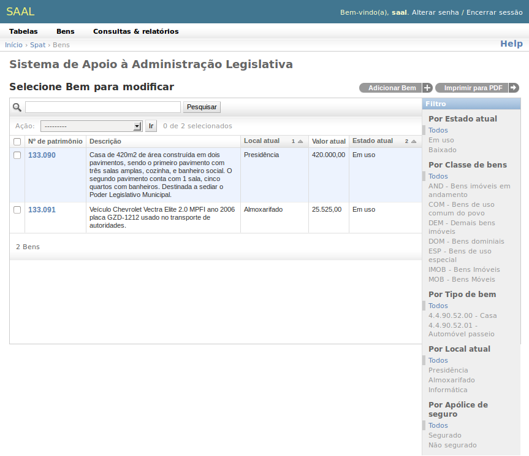

* **Por estado atual**: Filtra os bens que estão Em Uso ou Baixados.
* **Por classe de bens**: Permite definir uma classe de bens de interesse,
  ocultando os bens de todas as outras.
* **Por tipo de bem**: Filtra os bens com base no :ref:`spat_assetcatalog`
* **Por local atual**: Lista os bens de uma determinada :term:`Unidade Organizacional`
* **Por apólice de seguro**: Filtra os bens segurados (com seguro vigente na
  data atual) ou sem seguro.

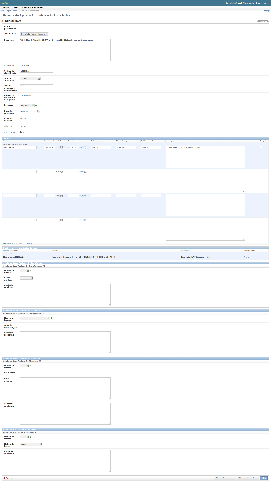

O :ref:`intro_changeform` de bens permite uma perfeita gerência dos bens. Além
de registrar as informações de identificação do bem, como seu número de 
patrimônio, tipo de bem, descrição, localização atual, dados de aquisição e
valor, permite que sejam gerenciados os seguros contratados para o bem,
apresenta o histórico de movimentações (apenas visualização), e permite
adicionar registros de:

* **Transferência**

  Transfere o bem do seu local atual para outra Unidade Organizacional. Deve ser
  informado o :ref:`modelo do termo <spat_termmodel>`, a unidade de destino e
  anotações adicionais.

* **Depreciação**

  Registra uma depreciação (perda de valor) do bem. Deve ser informado o
  :ref:`modelo do termo <spat_termmodel>`, o valor da depreciação e anotações
  adicionais.
  
* **Alteração**

  Registra alterações no bem, que podem ser acréscimos ou remoções de partes,
  de funcionalidades ou capacidades, que podem modificar seu valor e sua
  descrição. Deve ser informado o :ref:`modelo do termo <spat_termmodel>`, o
  novo valor do bem e sua nova descrição, além de anotações adicionais.
  
* **Baixa**

  Promove a baixa do bem. Devem ser informados o :ref:`modelo do termo <spat_termmodel>`,
  o motivo da baixa e anotações adiconais. Um bem baixado não poderá mais sofrer
  qualquer tipo de movimentação ou ter qualquer anotação de registro sobre ele.
  
Para imprimir um registro, deve-se primeiramente salvá-lo. Então, o registro
ficará no topo da lista de Histórico de movimentações, com um link para imprimir
o termo na coluna **Imprimir termo**.

.. _spat_insurancepolicy:

Seguros
"""""""

Além de lançar os seguros no próprio :ref:`intro_changeform` do bem, há a
possibilidade de se gerenciar as apólices em conjunto.

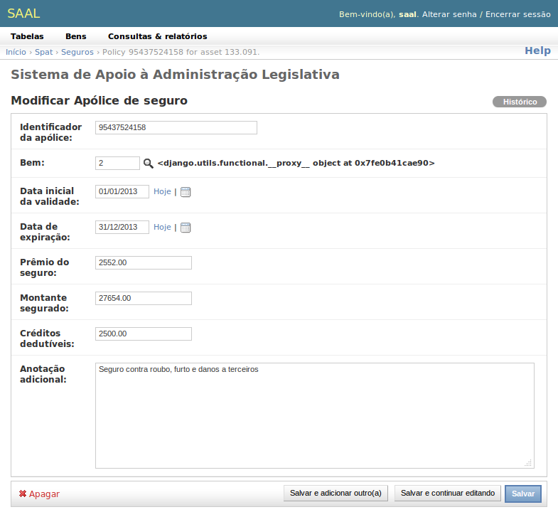

Pode-se filtrar as apólices por classe de bens, por tipo de bem e por local
atual do bem. Acima da :ref:`barra de pesquisa <intro_search_bar>` há a barra
de filtragem por data de vencimento das apólices. Esta barra permite pesquisas
interessantes, como as apólices que vencem no dia, no mês ou no ano.

.. _spat_inventory: 

Inventário mensal
"""""""""""""""""

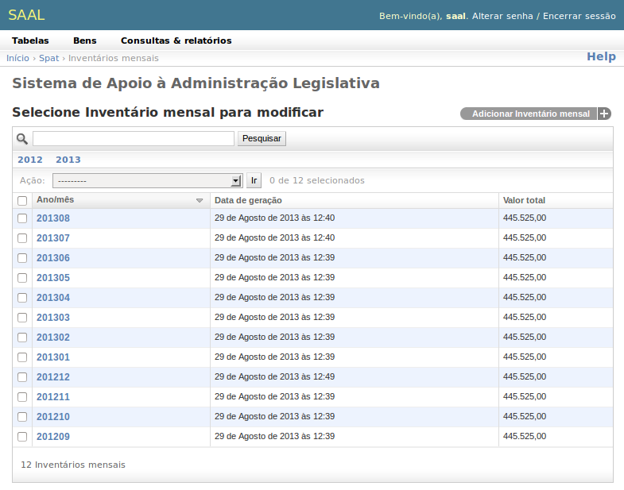

O inventário mensal é um registro estático da situação patrimonial da Casa em
dado mês. Precisa ser explicitamente gerado pelo operador do sistema. Ao criar
um novo inventário, o operador informa apenas o ano/mês que deseja inventariar.
O sistema gera uma imagem da situação patrimonial atual para aquele ano/mês.
O ideal é que o inventário seja gerado após terem sido lançadas todas as 
modificações do mês e antes que qualquer movimentação do mês seguinte aconteça.

Um inventário pode ser regerado quantas vezes for necessário e é atualizado com
a situação atual do patrimônio.

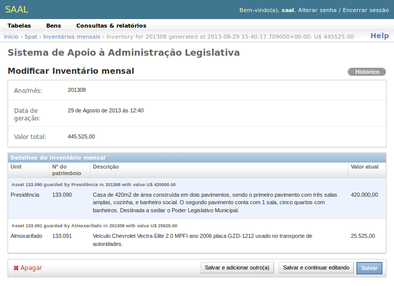
 
Consultas & relatórios
----------------------

.. _spat_inventoryreport:

Inventário patrimonial
""""""""""""""""""""""

Apresenta o inventário patrimonial de um mês por unidade. O relatório analítico
apresenta os bens de cada :term:`Unidade Organizacional`, agrupando e
totalizando por Unidade. O relatório sintético apresenta o valor total dos bens
patrimoniais de cada unidade, sem mostrar os detalhes dos bens.

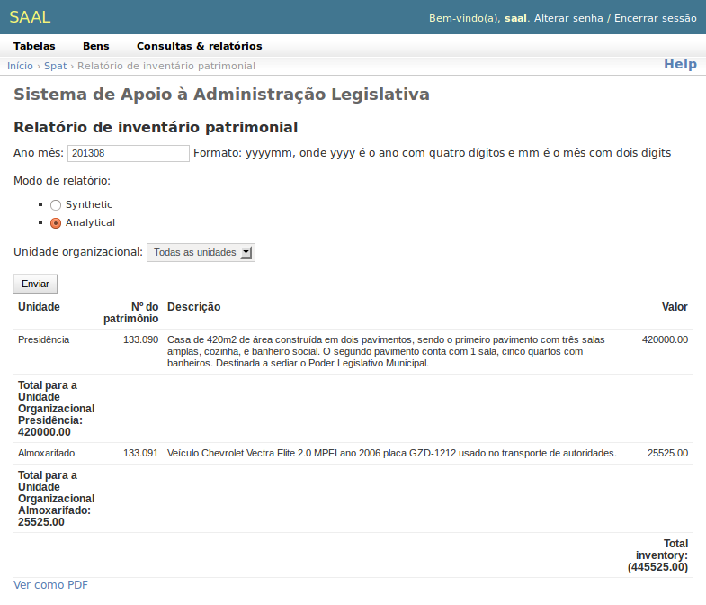

.. _spat_sheetevolutionreport:

Evolução patrimonial
""""""""""""""""""""

Apresenta, mês a mês a evolução patrimonial de cada :term:`Unidade Organizacional`
da Casa, em forma de tabela.

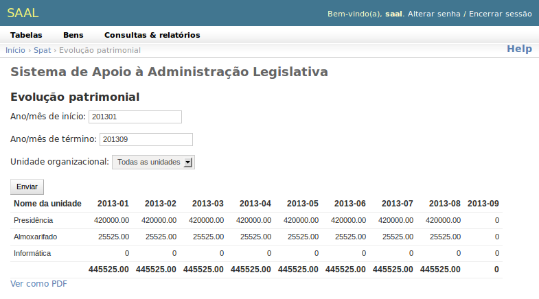

.. _spat_writedownbycausereport:

Bens Baixados por Motivo
""""""""""""""""""""""""

Relaciona os bens que foram baixados no período, relacionando a causa da baixa.

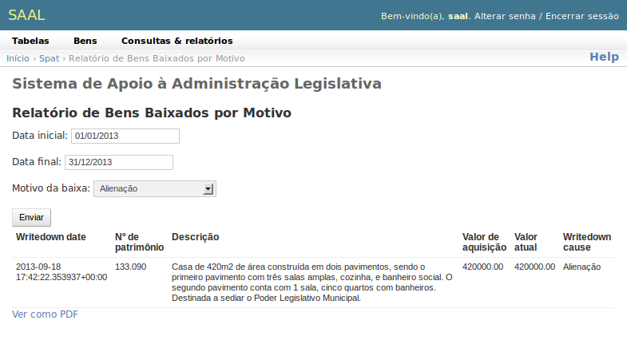

.. _spat_movementbyperiodreport:

Movimentos por Período
""""""""""""""""""""""

Relaciona os registros de movimento de bens patrimoniais ocorridos no período.

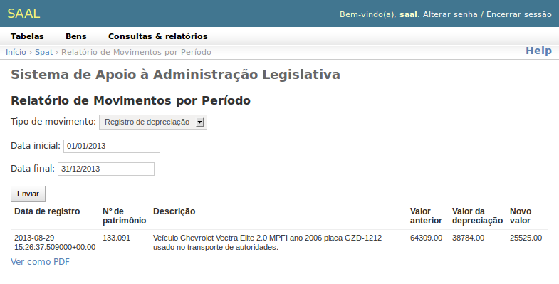